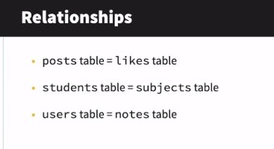

### Authentication using Breeze

Get Breeze package
- $ sail composer require laravel/breeze --dev

Add Breeze's Authentication scaffolding
- $ sail artisan breeze:install

### Create a model, Create a corresponding migration

- $ sail artisan make:model Note --migration

### Run migrations

- $ sail artisan migrate

### Create a controller with all the methods needed for CRUD operations

NOTE: Laravel does this for you automatically

- $ sail artisan make:controller NoteController --resource

### Rollback migration

After deleting all the records from a table. Always rollback the migration
ie. Rollback the last database migration

- $ sail artisan migrate:rollback

Rerun the migration after making changes to it

- $ sail artisan migrate

### Relationships

- A post can have many likes
- A user can have many notes
- A student can take many subjects

